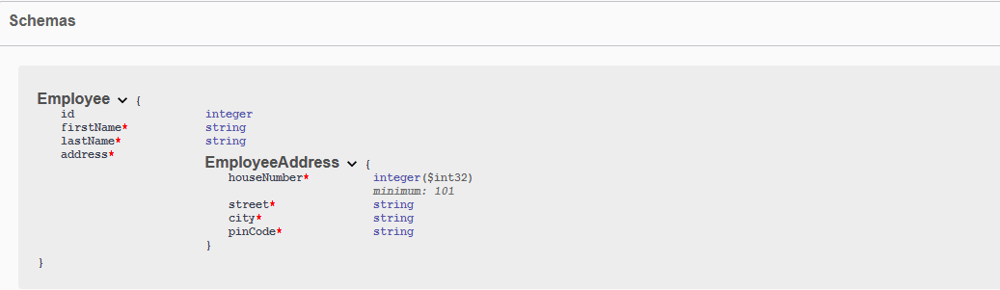
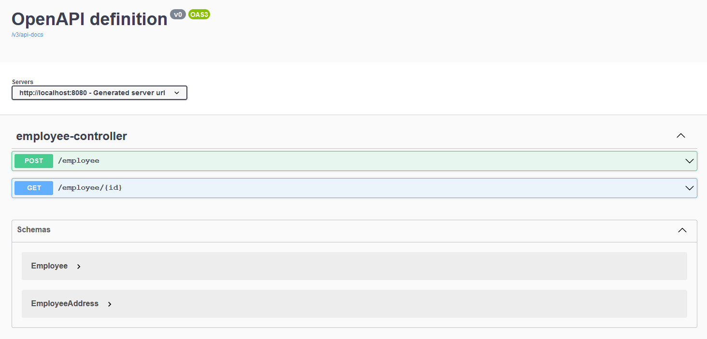
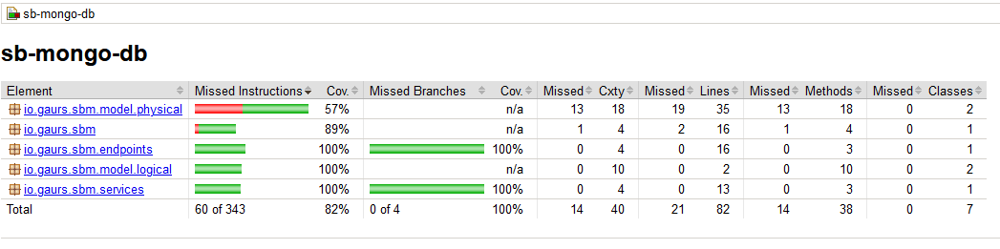

# Springboot, MongoDB and OpenAPI

A sample springboot application with MongoDB as backend created to demonstrate the usage of [OpenApi](https://swagger.io/specification/).

## MongoDB setup

The following command will start a mongo database (as a docker container) with some pre-configured values:

1. **username**: root
2. **password**: password
3. **database**: employee
4. **port**: 27017

```bash
# start mongodb container
docker run --name mongodb -p 27017:27017 -e MONGO_INITDB_ROOT_USERNAME=root -e MONGO_INITDB_ROOT_PASSWORD=password -e MONGO_INITDB_DATABASE=employee -d mongo:latest
```

Once this is done, the database should be available at the following location: `mongodb://localhost:27017/employee`

## Connection properties

```yaml
spring:
  application:
    name: SpringBootMongoDBDemo
  # database connectivity options
  data:
    mongodb:
      port: 27017
      host: localhost
      authentication-database: admin
      username: root
      password: password
      database: employee

# app port
server:
  port: 8080
```

## Packages

1. **endpoints**: the public endpoints marked with `@RestController` annotation.
2. **models**:
   1. **logical**: the published logical models.
   2. **physical**: actual physical models.
3. **repositories**: MongoRepositories to perform crud operations.
4. **services**: a collection of classes to abstract business logical from the other layers.

## To be noted

1. The `id` in `Employee` and `EmployeePhysical` is marked as `BigInteger` as mongo does not auto generate an id of type `Long`. Refer to [this](https://stackoverflow.com/questions/26574409/spring-data-mongodb-generating-ids-error) link for details.
2. If the `id` is populated in the request body, the same will be used. Otherwise, an autogenerated value will be assigned.
3. The fields in the `record` classes like `Employee` and `EmployeeAddress` that are published via public endpoints are marked with `@JsonProperty` to allow serialization and deserialization.
4. Both `EmployeePhysical` and `EmployeeAddressPhysical` have their parameterized constructors marked with `@PersistenceCreator` to allow  
   **spring-data-mongodb** to do correct mappings. If not present, the following exception is thrown:

```text
org.springframework.data.mapping.model.MappingInstantiationException: Failed to instantiate io.gaurs.sbm.model.physical.EmployeePhysical using constructor NO_CONSTRUCTOR with arguments 
...
...
Caused by: org.springframework.beans.BeanInstantiationException: Failed to instantiate [io.gaurs.sbm.model.physical.EmployeePhysical]: No default constructor found; nested exception is java.lang.NoSuchMethodException: io.gaurs.sbm.model.physical.EmployeePhysical.<init>()
```

## Open API Documentation

When [migrating](https://springdoc.org/#migrating-from-springfox) from **SpringFox**, the following mappings are really helpful when re-writing your annotations:

```textmate
    @Api → @Tag
    @ApiIgnore → @Parameter(hidden = true) or @Operation(hidden = true) or @Hidden
    @ApiImplicitParam → @Parameter
    @ApiImplicitParams → @Parameters
    @ApiModel → @Schema
    @ApiModelProperty(hidden = true) → @Schema(accessMode = READ_ONLY)
    @ApiModelProperty → @Schema
    @ApiOperation(value = "foo", notes = "bar") → @Operation(summary = "foo", description = "bar")
    @ApiParam → @Parameter
    @ApiResponse(code = 404, message = "foo") → @ApiResponse(responseCode = "404", description = "foo")
```

When our model includes **JSR-303** bean validation annotations, such as `@NotNull`, `@NotBlank`, `@Size`, `@Min`, and `@Max`, the **springdoc-openapi** library uses them to generate additional schema documentation for the corresponding constraints



Once the application is running, the open api documentation can be accessed at: `http://localhost:8080/v3/api-docs/`. The api playground is also 
available to be explored at: `localhost:8080/swagger-ui.html`



## Coverage

The code coverage is idol for the endpoints and service packages. The model lags behind due to the instances being mocked for test purpose



## To Do

The following tasks are pending and will be available in coming weeks:

1. Enable Streaming using webflux
2. Integrate Spring Security

## Docker Integration

Refer to [Dockerfile](Dockerfile) for the image template. Additionally, the **pom.xml** file is already updated to include `dockerfile-maven-plugin` which  will trigger the docker image build  based on the config  parameters specified. Make sure to trigger `EXPORT DOCKER_HOST=<host>:2375` before you run the maven build to indicate docker daemon waiting for inbound connections.

If you refer to [application.yml](src/main/resources/application.yml), you will find that the application is configured to discover mongodb 
instance via a specific name matching the mongodb container we started previously:

```yml
  data:
    mongodb:
      port: 27017
      host: mongodb
```

To allow container discovery, make sure to start both the containers using same network:

```bash
docke run --name mongodb -p 27017:27017 -e MONGO_INITDB_ROOT_USERNAME=root -e MONGO_INITDB_ROOT_PASSWORD=password -e MONGO_INITDB_DATABASE=employee -d --network my_subnet mongo:latest
docker container run --rm -p 8080:8080 --network my_subnet sb-mongo-db:0.0.1-SNAPSHOT
```